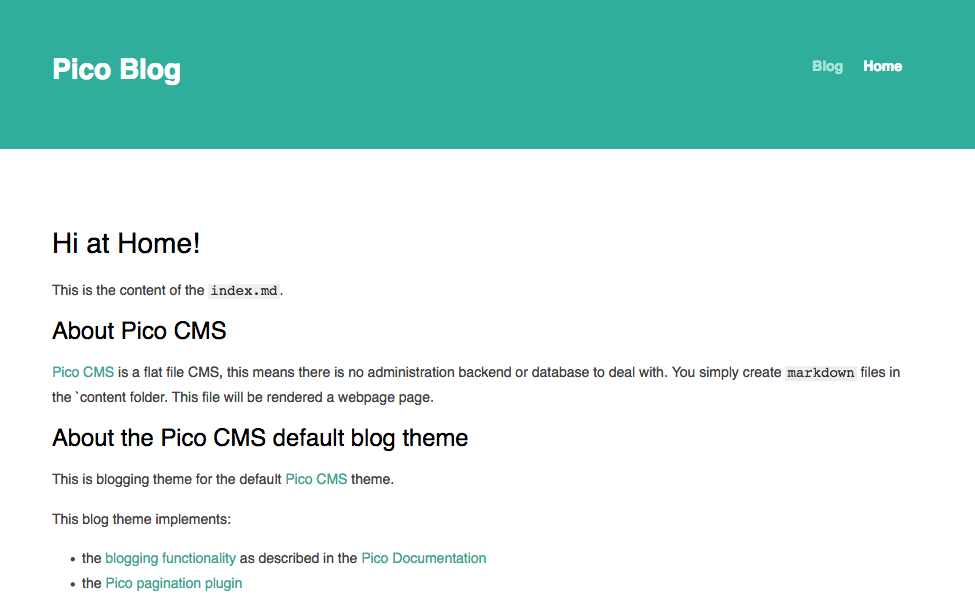

# Pico CMS default blog theme

This is blogging theme for the default [Pico CMS](http://picocms.org/) theme.

## About Pico CMS 

[Pico CMS](http://picocms.org/) is a flat file CMS, this means there is no administration backend or database to deal with. You simply create `markdown` files in the `content` folder. This file will be rendered a webpage page. 

## About the Pico CMS default blog theme

This blog theme implements: 

- the [blogging functionality](http://picocms.org/docs/#blogging) as described in the [Pico Documentation](http://picocms.org/docs/)
- the [Pico pagination plugin](https://github.com/rewdy/Pico-Pagination)

## Installation

1. Copy the `default-blog` folder in your `themes` subdirectory of the Pico installation directory.
2. Copy the `pagination.php` file to the `plugins` folder
3. Enable the Pico Blog theme in your `config.php` file: `$config['theme'] = 'default-blog';` (you can find that file in your `config` folder)

